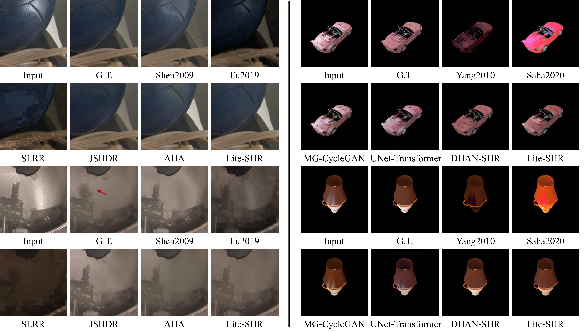
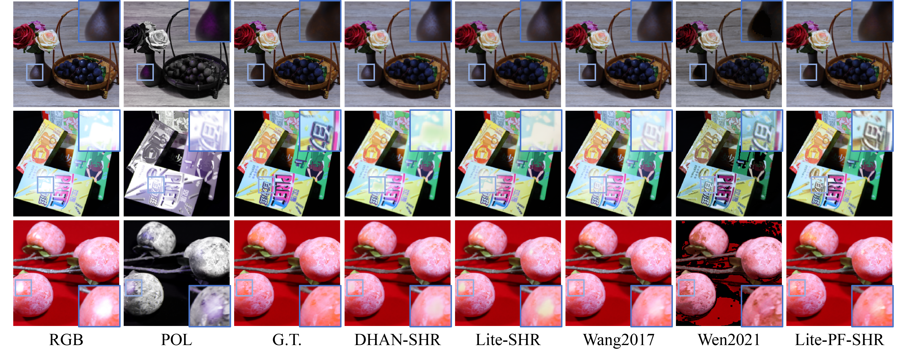

# PHRNet
[PHRNet: Polarimetric Highlight Removal via Hierarchical Frequency-Spatial Co-Attention] <br/>
Junzhuo Zhou, Ye Qiu, Zhihe Liu, Jun Zou, Jia Hao, Junyi Yang, Wenli Li, Yiting Yu  <br/>

## Demo Display
 <br/>
*Figure 1: Visual comparisons of our method against state-of-the-art highlight removal methods on the testing sets of the SHIQ and SSHR datasets. Results on the left side of the divider are from the SHIQ dataset, while those on the right are from the SSHR dataset.*

 <br/>
*Figure 2: Visual comparison results of PHRNet and other methods on the PSD dataset.*

## Environment
* NVIDIA RTX 4090
* python 3.8

### Create a virtual environment and activate it.

```Shell
conda create -n PHRNet python=3.8
conda activate PHRNet
```
### Dependencies

```Shell
pip install torch==2.0.0 torchvision==0.15.1 torchaudio==2.0.1 --index-url https://download.pytorch.org/whl/cu118
pip install timm==0.5.4

```

## Required Data

* [dehighlight](https://www.kaggle.com/datasets/xuhangc/acm-mm-2024-dehighlight-dataset)
* [PSD](https://github.com/jianweiguo/SpecularityNet-PSD)
* [SHIQ](https://github.com/fu123456/SHIQ)
* [SSHR](https://github.com/fu123456/TSHRNet?tab=readme-ov-file)

## Citation

If you find our works useful in your research, please consider citing our papers:

```bibtex

```
